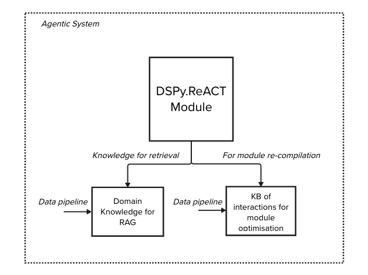

# watsonx.ai DSPy ReACT Single Agent Example

# Overview

This repo contains a demonstration of AI Agent that follows the ReACT agentic-pattern build with DSPy.ReAct and a watsonx.ai language model. This demonstration uses a local instance of MilvusDB as a datastore for domain knowledge, a dataset (HotPotQA loaded in memory) for optimising the dspy Module and a local embeddings model.

# Quick Start

- install dependencies (requirements.txt TBC)
- export `WATSONX_URL`, `WATSONX_APIKEY`, `WATSONX_PROJECTID` as envars
- Launch Milvus `docker-compose up`
- Load the collection, go to `http://localhost:8010` and login with `http://milvus-standalone:19530`
- Load the data `load_data.py`
- Run the agent `agent.py`

